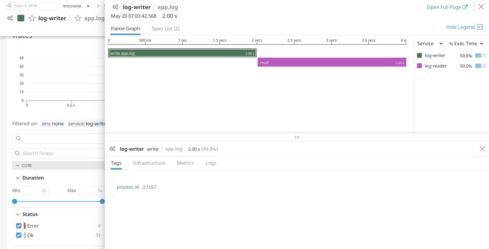

# dd-distrubuted-tracing

A sample of distributed tracings with Datadog in Golang for non-HTTP services.

As me, maybe you got sad when you found that DataDog didn't have enough documentation about distributed tracing for non-HTTP services. 

I decided to write this really simple example to explain it.


## How it works.

I have to go routines in the app.

## reader

The first one is a file reader. It mimics the `tail -f` command. Each line of the file will be a `trace_id` written by other app.

## writer

The second one, is a writer. It writes to a file lines, lines that contain a `trace_id`.

Both on the whole create a distrubuted trace system.

The writer creates a `tracer` and writes its `id` in the file, then asyncronously the reader gets the line and parses it to get the _shared_ `trace_id`. After that the reader uses it to recreate the context of its parent (the writer), and then uses it in the new trace created in the reader.

It will allow to see metrics like the shown below in DataDog, 




## How to run?

First copy the file `example.env` to `.env` and set your `DD_API_KEY`.

Then run:

```
docker-compuse up
```